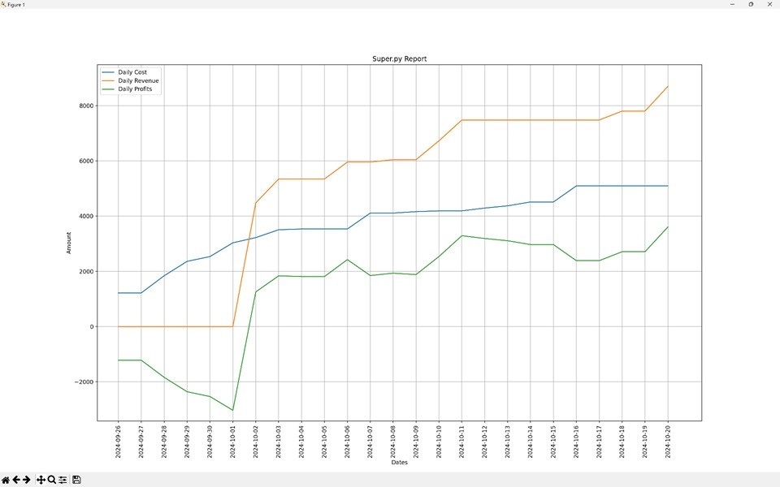
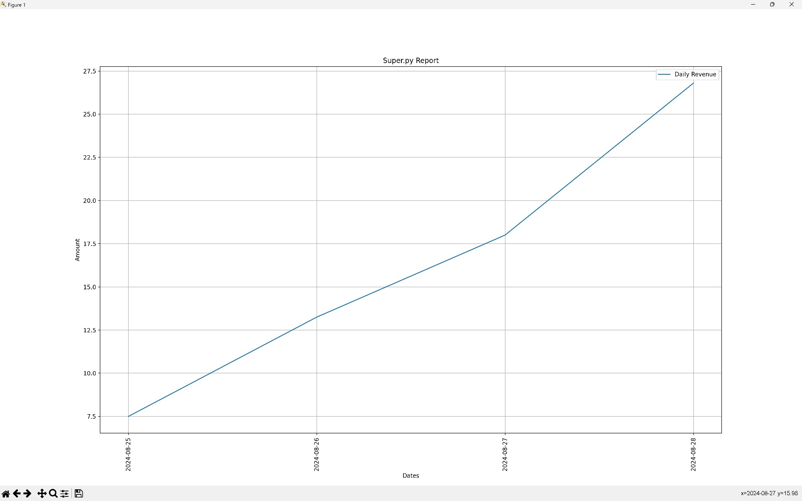

# SuperPy

## Description

SuperPy is a command-line tool that is able to keep track of inventory and producing reports and charts.


## Dependencies

* Python 3.9


## Contents

* [**config.json**](./config.json) - The application config file.
* [**requirements.txt**](./requirements.txt) - The application requirements file.
* [**super.py**](./super.py) - The main program file.
* [**superpy/args.py**](./superpy/args.py) - Code to parse the commandline arguments.
* [**superpy/config.py**](./superpy/config.py) - Code to parse the config.json file.
* [**superpy/convert.py**](./superpy/convert.py) - Code for performing certain conversions.
* [**superpy/current_date.py**](./superpy/current_date.py) - Code to control the date that the application perceives as 'today'.
* [**superpy/inventory.py**](./superpy/inventory.py) - Code to manage the applications inventory.
* [**superpy/io.py**](./superpy/io.py) - Code to read and write from and to different file formats.
* [**superpy/report.py**](./superpy/report.py) - Code to create a report table or chart.
* [**superpy/validate.py**](./superpy/validate.py) - Code to perform various validations.
* [**tests/test_superpy.py**](./tests/test_superpy.py) - The application unit tests.


## Installing SuperPy

Installation of the superpy application is as follows:

1. Create a python virtual environment and activate it:
```console
> py -3.9 -m venv venv --prompt venv
> ./venv/Scripts/activate
```

2. Install requirements file:
```console
(venv)> pip install -r requirements.txt
```


## Usage

The SuperPy application consists of a few **basic commandline** functions and each of these basic command contain *subcommads*:

* **date** - Command to get or set the application date.  
    
    *-sd, --set-date [new_date]* - Sets a new current date for the application.
    ```console
    > python super.py date --set-date 2024-08-25
    The new super.py date is "2024-08-25"
    ```

    *-gd, --get_date* - Gets the application's current date.
    ```console
    > python super.py date --get-date
    The current super.py date is "2024-08-25"
    ```

    *-ad, --advance-date [days]* - Advances or disadvances the application's current date.
    ```console
    > python super.py date --advance-date 1
    The new super.py date is "2024-08-26"
    
    > python super.py date --advance-date -2
    The new super.py date is "2024-08-24"
    ```

* **buy** - Command for buying products.

    *-pn, --product-name [name]* - The name of the product to buy.  
    *-p, --price [price]* - The buy price.  
    *-q, --quantity [quantity]* - The buy quantity. When omitted a qunatity of 1 is assumed.  
    *-ed, --expiration-date* - The product expiration date.  
    ```console
    > python super.py buy --product-name orange --price 0.8 --quantity 5 --expiration-date  2024-08-30
    OK
    ```

* **sell** - command for selling products.

    *-pn, --product-name [name]* - The name of the product to sell.  
    *-p, --price [price]* - The selling price.  
    *-q, --quantity [quantity]* - The sell quantity. When omitted a qunatity of 1 is assumed. 
    ```console
    > python super.py sell --product-name orange --price 2.5 --quantity 2
    OK
    ```

* **report** - command for creating reports.

    * ***inventory** [-pn product_name] [date_keyword] [-e filename]* - Creates a table report of the available products in the inventory for the specified date.
    
    * ***profit** [-pn product_name] [date_keyword]* - Specifies the earned profit for the specified date.
    
    * ***revenue** [-pn product_name] [date_keyword]* - Specifies revenue made for the specified date.
    
    * ***cost** [-pn product_name] [date_keyword]* - Specifies cost made for the specified date.
    
    * ***expired** [-pn product_name] [date_keyword] [-e filename]* - Creates a table report of the expired products in the inventory for the specified date.
    
    * ***sold** [-pn product_name] [date_keyword] [-e filename]* - Creates a table report of the sold products in the inventory for the specified date.
    
    The *[date_keyword]* can be any of the following keyword as a report date:  
    * *--now* - Represents the application's current date.
    * *--today* - Represents the computer's current date.
    * *--yesterday* - Represents the day before the application's current date.
    * *--date [date]* - Represents a specific date in the format "YYYY-MM-dd", "YYYY-MM" or "YYYY".
    
    The *[-e filename]* exports the report table to the specified file. The file extension in the filename determines the filetype to export to. Currently supported filetypes are **.csv*, **.xml*, **.json*.

    Example to create a report using the *--now* keyword: 
    ```console
    > python super.py report inventory  --now
    +----+-----------+-----------+----------+------------+-----------------+
    | Id | Name      | Buy Price | Quantity | Buy Date   | Expiration Date |
    +====+===========+===========+==========+============+=================+
    | 1  | mango     | 0.25      | 2        | 2024-08-25 | 2024-08-30      |
    +----+-----------+-----------+----------+------------+-----------------+
    | 2  | avocado   | 0.35      | 5        | 2024-08-25 | 2024-08-29      |
    +----+-----------+-----------+----------+------------+-----------------+
    | 3  | guava     | 0.1       | 15       | 2024-08-25 | 2024-09-04      |
    +----+-----------+-----------+----------+------------+-----------------+
    | 5  | pineapple | 1.25      | 1        | 2024-08-26 | 2024-09-02      |
    +----+-----------+-----------+----------+------------+-----------------+
                               Total quantity: 23
    ```
    
    Example create a report using the *--date* keyword with the "YYYY-MM-dd":
    ```console
    > python super.py report sold --date 2024-08-26
    +----+---------+------------+----------+------------+
    | Id | Name    | Sell Price | Quantity | Sell Date  |
    +====+=========+============+==========+============+
    | 1  | mango   | 1.25       | 3        | 2024-08-26 |
    +----+---------+------------+----------+------------+
    | 2  | avocado | 1.0        | 2        | 2024-08-26 |
    +----+---------+------------+----------+------------+
                      Total quantity: 5
    ```
    
    Example create a report using the *--date* keyword with the "YYYY-MM" format to get all sold items in august:
    ```console
    > python super.py report sold --date 2024-08   
    +----+---------+------------+----------+------------+
    | Id | Name    | Sell Price | Quantity | Sell Date  |
    +====+=========+============+==========+============+
    | 1  | mango   | 1.5        | 5        | 2024-08-25 |
    +----+---------+------------+----------+------------+
    | 1  | mango   | 1.25       | 3        | 2024-08-26 |
    +----+---------+------------+----------+------------+
    | 2  | avocado | 1.0        | 2        | 2024-08-26 |
    +----+---------+------------+----------+------------+
                     Total quantity: 10
    ```
    
    Example to export a report of products who will expire in august using the *-pn*, *--date* and *-e* keywords:
    ```console
    > python super.py report expired --date 2024-08 -e ./data/export.xml
    +----+---------+-----------+----------+------------+-----------------+
    | Id | Name    | Buy Price | Quantity | Buy Date   | Expiration Date |
    +====+=========+===========+==========+============+=================+
    | 1  | mango   | 0.25      | 2        | 2024-08-25 | 2024-08-30      |
    +----+---------+-----------+----------+------------+-----------------+
    | 2  | avocado | 0.35      | 5        | 2024-08-25 | 2024-08-29      |
    +----+---------+-----------+----------+------------+-----------------+
                              Total quantity: 7
    Exporting products to ".\data\export.xml"...
    ```
    
    Examples using the *cost*, *revenue* and *profit* keywords:
    ```console
    > python super.py report cost --now
    Today's costs so far: 4.0
    
    > python super.py report revenue --yesterday
    Yesterday's revenue: 5.0
    
    > python super.py report profit --date 2024-08-24
    Profit from Saturday 24 August 2024: 1.0
    ```

* **chart** - Command for creating charts.

    *-r, --revenue* - Creates a chart for the revnue.  
    *-p, --profit* - Creates a chart for the profit.  
    *-c, --cost* - Creates a chart for the costs.  
    *-pn, --product-name* - The name of a product. When omitted all products will be used.  
    *-d, --date [date]* - Represents a specific date in the format "YYYY-MM-dd", "YYYY-MM" or "YYYY". When omitted all products with all dates will be used.  
    
    Example using only the chart type keywords:
    ```console
    > python super.py chart -c -r -p
    Creating chart for cost, revenue, profit...
    ```
    

    Example using the "YYYY-MM" date format to get the revenue within a month:
    ```console
    > python super.py chart -r --date 2024-08
    Creating chart for revenue...
    ```
    


## Testing

The *test_superpy.py* file consists of several unit tests which can be run as follows:
```console
> python -m pytest --basetemp='./tests/tmp'
```
or for a more elaborate view:
```console
> python -m pytest --basetemp='./tests/tmp' -vv
```
