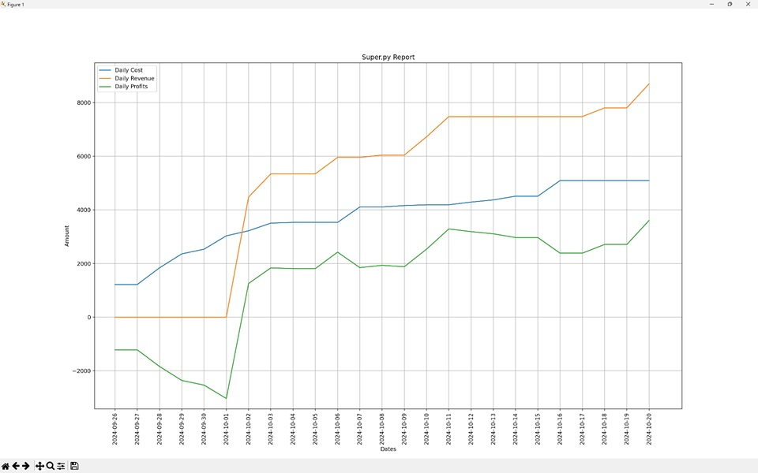

# Report

For this assignment I find the following implementations notable:

## Usage of pytest and random testdata

The usage of *pytest* was an attempt using the TDD (test driven development) style to ensure more code stability and less bugs (well at least in theory...) while developing. It took some planning ahead about what kind of functions where needed, but TDD helped me creating smaller functions that perform only one certain task and changes to functions where more stabel because the outcome of the testresults needed to be the same. The idea of using random data was so I was constanly able to test different inputs more like a real world scenario. In the testcode I also included a fixture with config for further finetuning and control of the testdata:
```json
"test": {
    "product_range" : 100,
    "current_date" : "2024-02-04",
    "max_past_days" : 6,
    "max_future_days" : 14,
    "folder": f"{superpy_test_folder}"
}
```

## Usage of a config file

With the use of *config.py* and *config.json* file a user can alter the file locations and config so the application can be used in different environments and no need for hard-coding paths. The *config.py* module can be imported in all parts of the code where the config needs to be used, for example getting the location of the *bought.csv* file to determine the latest product id:
```python
def get_product_id():
    products = io.read_csv(config.data["files"]["bought"])
    if products:
        products.reverse()
        new_product_id = int(products[0]['id']) + 1
        return new_product_id
    return 1
```

## Export function

With the *inventory.export_products_to_file()* it is possible to export a product list to a file. Depending on the given file extension in the filename the export will convert the product list to that filetype. The supported fileypes are *.csv, *.json and *.xml. The report command uses this to easily create an export of the generated report tables.

## Using a filter function

The *filter_product_list()* and *filter_products()* functions make it possible to perform multiple filters on a products list. With simple operators like '==', '!=', '<=', '>=', '<<' or '>>' it is possible to add an list of filters to get a specific set of the product list. For example *get_bought_products()* function uses *[f'name=={product_name}',f'buy_date=={buy_date}']* to filter the bought products by name and buy date:
```python
def get_bought_products(product_name:str='',
                        buy_date:str=''):
    found_products = []
    product_quantity = 0
    products = io.read_csv(config.data["files"]["bought"])
    if products:
        product_filters = [f'name=={product_name}',f'buy_date=={buy_date}']
        found_products = filter_product_list(products, product_filters)
        product_quantity = sum([int(product['quantity']) for product in found_products])
    return found_products, product_quantity
```

## Getting daily chart values

The *get_daily_chart_values()* function converts the bought and sold product lists to a dictionary with sorted dates as keys and product revenues, cost or profits as values. With this dictionary it is possible to plot multiple graphs in a single chart:
```python
def product_chart(chart_types:list,
                  bought_products:list=[],
                  sold_products:list=[]):
    ...
    for chart in charts.keys():
        x_values = list(charts[chart].keys())
        y_values = list(charts[chart].values())
        plt.plot(x_values, y_values, label=chart)
        ...
        plt.show()
```

